# mermaid

---

## 前言

编写文档时常需要插入各种图表，比如流程图、UML、类图、组织结构图、泳道图、E-R图、思维导图等。

常用的画图的工具主要有 Visio ， XMind ， MindManager ， ProcessOn ， draw.io 等。

推荐一款在线的免费的图表绘制工具 [draw.io](https://drwa.io/)

以上这些，都是 **画图** 工具，使用起来略显复杂。

如果追求极简，可以使用 **写图** 工具： **美人鱼** **mermaid** 。

---

## 美人鱼

**mermaid** 是一个基于 `JavaScript` 的图表绘制工具，它使用 `Markdown` 启发的文本定义和渲染器来创建和修改复杂的图表。

mermaid 的语法非常简单，它使用类似于 Markdown 的语法来定义图表。

通过 mermaid ，您可以轻松的定义图表，而不必担心图表的布局。

mermaid 将自动为您处理所有这些事情。

官方网站：

- [Mermaid | Diagramming and charting tool](http://mermaid.js.org/)

在线体验：

- [Mermaid Live Editor](https://mermaid.live/)

官方文档：

- [About Mermaid | Mermaid](http://mermaid.js.org/intro/)

以下是代码示例和效果预览

---

## 流程图

流程图由节点（几何形状）和边缘（箭头或线条）组成。

mermaid 代码定义了节点和边的制作方式，并适应不同的箭头类型、多向箭头以及与子图之间的任何链接。

参考： [Flowcharts Syntax | Mermaid](http://mermaid.js.org/syntax/flowchart.html)

```text
flowchart TD
    A[Christmas] -->|Get money| B(Go shopping)
    B --> C{Let me think}
    C -->|One| D[Laptop]
    C -->|Two| E[iPhone]
    C -->|Three| F[fa:fa-car Car]
```

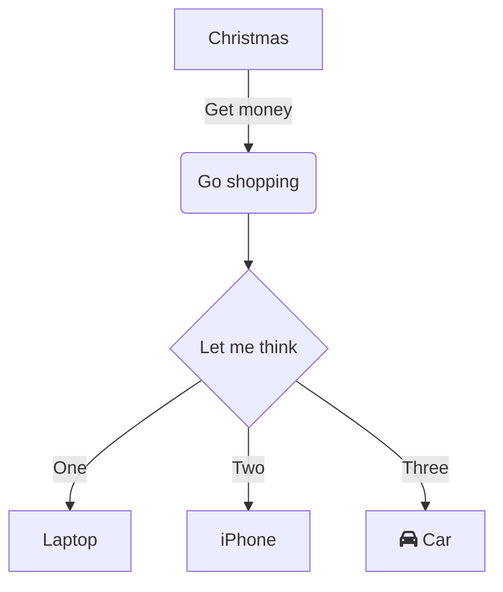

---

## 时序图

时序图是一种交互图，它显示了进程如何相互操作以及以什么顺序运行。

参考： [Sequence Diagram Syntax | Mermaid](http://mermaid.js.org/syntax/sequenceDiagram.html)

```text
sequenceDiagram
    participant Alice
    participant Bob
    Alice->>John: Hello John, how are you?
    loop Healthcheck
        John->>John: Fight against hypochondria
    end
    Note right of John: Rational thoughts <br/>prevail...
    John-->>Alice: Great!
    John->>Bob: How about you?
    Bob-->>John: Jolly good!
```

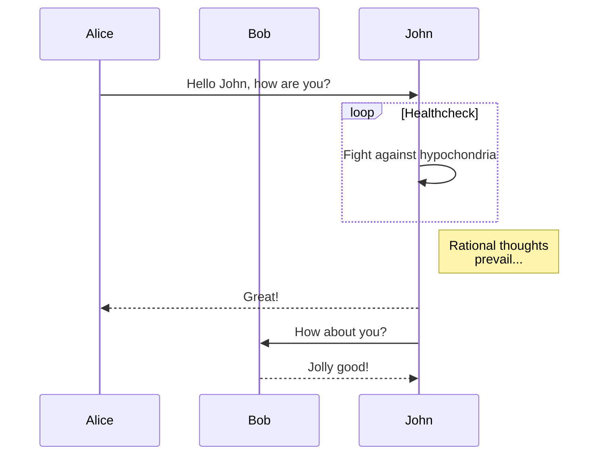

---

## 类图

类图是一种静态结构图，用于显示系统中的类、它们的属性和方法以及它们之间的关系。

参考： [Class Diagram Syntax | Mermaid](http://mermaid.js.org/syntax/classDiagram.html)

```text
---
title: Animal example
---
classDiagram
    note "From Duck till Zebra"
    Animal <|-- Duck
    note for Duck "can fly\ncan swim\ncan dive\ncan help in debugging"
    Animal <|-- Fish
    Animal <|-- Zebra
    Animal : +int age
    Animal : +String gender
    Animal: +isMammal()
    Animal: +mate()
    class Duck{
        +String beakColor
        +swim()
        +quack()
    }
    class Fish{
        -int sizeInFeet
        -canEat()
    }
    class Zebra{
        +bool is_wild
        +run()
    }
```

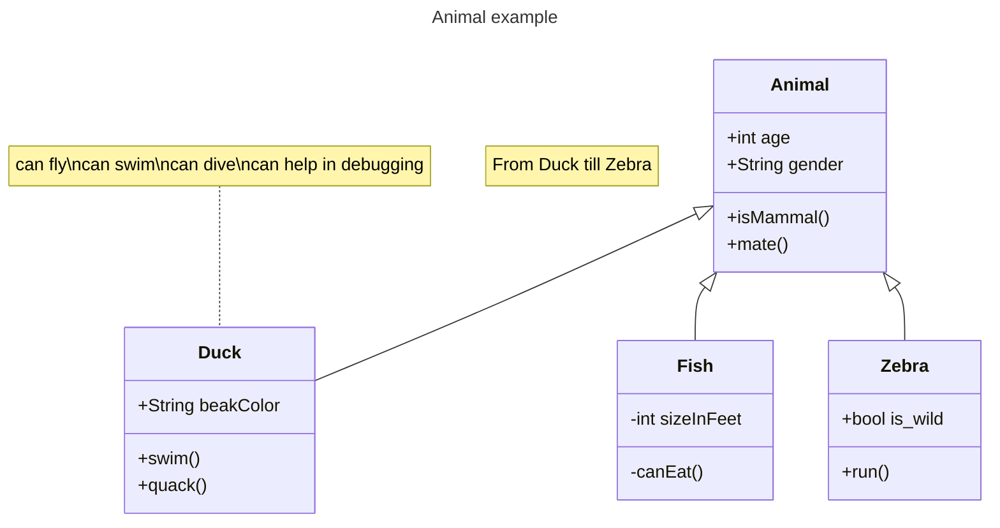

---

## 状态图

mermaid 可以渲染状态图。

该语法尝试与 plantUml 中使用的语法兼容，因为这将使用户更容易在 mermaid 和 plantUml 之间共享图表。

参考： [State Diagram Syntax | Mermaid](http://mermaid.js.org/syntax/stateDiagram.html)

```text
stateDiagram-v2
    [*] --> Still
    Still --> [*]

    Still --> Moving
    Moving --> Still
    Moving --> Crash
    Crash --> [*]
```

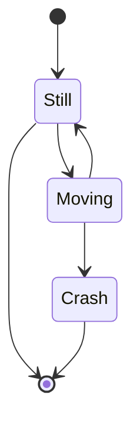

横向和嵌套

```text
stateDiagram
    direction LR
    [*] --> A
    A --> B
    B --> C
    state B {
      direction LR
      a --> b
    }
    B --> D
```

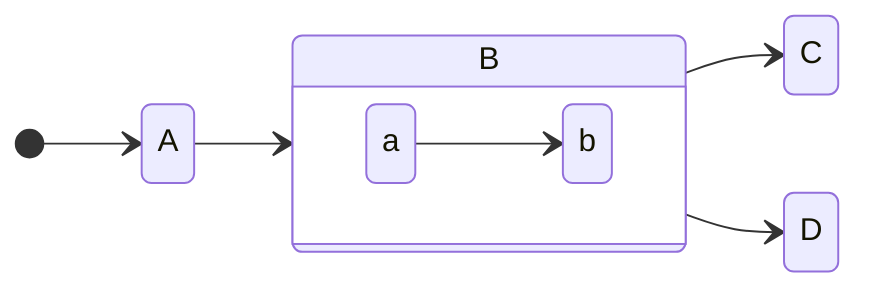

---

## 实体关系图

实体关系模型（或 ER 模型）描述了特定知识领域中感兴趣的相互关联的事物。

基本 ER 模型由实体类型（对感兴趣的事物进行分类）组成，并指定实体之间可以存在的关系（这些实体类型的实例）。

参考： [Entity Relationship Diagram Syntax | Mermaid](http://mermaid.js.org/syntax/EntityRelationshipDiagram.html)

```text
erDiagram
    CUSTOMER }|..|{ DELIVERY-ADDRESS : has
    CUSTOMER ||--o{ ORDER : places
    CUSTOMER ||--o{ INVOICE : "liable for"
    DELIVERY-ADDRESS ||--o{ ORDER : receives
    INVOICE ||--|{ ORDER : covers
    ORDER ||--|{ ORDER-ITEM : includes
    PRODUCT-CATEGORY ||--|{ PRODUCT : contains
    PRODUCT ||--o{ ORDER-ITEM : "ordered in"
```

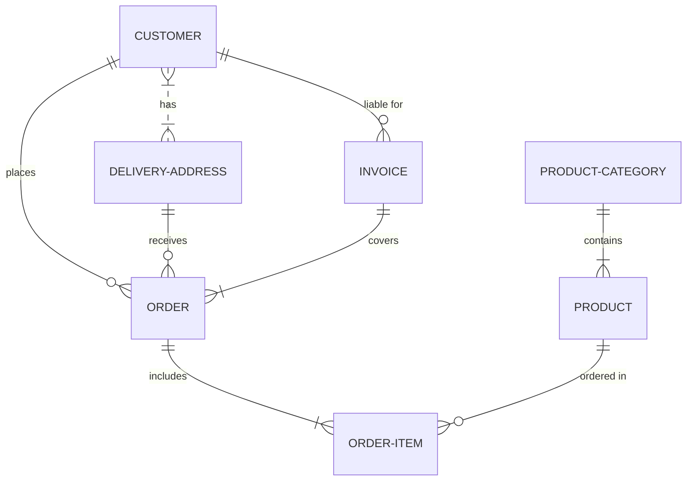

---

## 用户旅程图

用户旅程非常详细地描述了不同用户在系统、应用程序或网站中完成特定任务所采取的步骤。

此技术显示当前（按原样）用户工作流，并揭示未来工作流的改进领域。

参考： [Journey Diagram Syntax | Mermaid](http://mermaid.js.org/syntax/journeyDiagram.html)

```text
journey
    title My working day
    section Go to work
      Make tea: 5: Me
      Go upstairs: 3: Me
      Do work: 1: Me, Cat
    section Go home
      Go downstairs: 5: Me
      Sit down: 3: Me
```

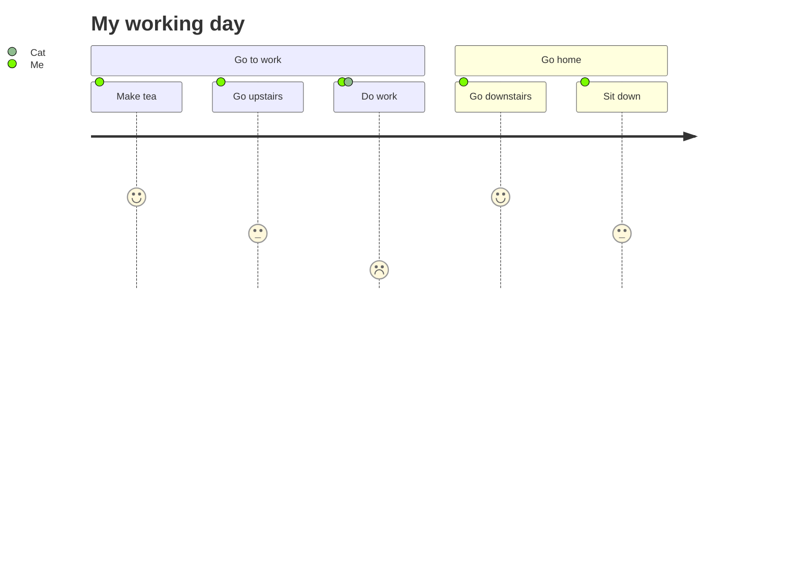

---

## 甘特图

甘特图是一种条形图，它说明了项目时间表以及任何一个项目完成所需的时间。

甘特图说明了项目的最终元素和摘要元素的开始日期和完成日期之间的天数。

参考： [Gantt Diagram Syntax | Mermaid](http://mermaid.js.org/syntax/ganttDiagram.html)

```text
gantt
    dateFormat  YYYY-MM-DD
    title Adding GANTT diagram to mermaid
    excludes weekdays 2014-01-10

    section A section
    Completed task            :done,    des1, 2014-01-06,2014-01-08
    Active task               :active,  des2, 2014-01-09, 3d
    Future task               :         des3, after des2, 5d
    Future task2               :         des4, after des3, 5d
```

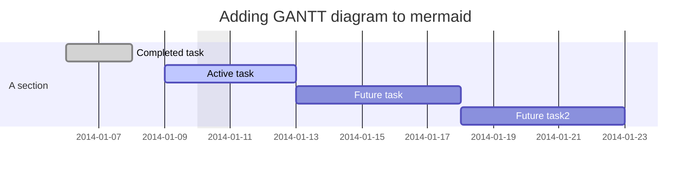

---

## 饼图

饼图（或圆形图）是一种圆形统计图形，它被分成多个切片来说明数字比例。

在饼图中，每个切片的弧长（以及其中心角和面积）与其表示的数量成正比。

虽然它因其与切片馅饼的相似之处而得名，但它的呈现方式有所不同。

参考： [Pie Chart Syntax | Mermaid](http://mermaid.js.org/syntax/pie.html)

```text
pie title Pets adopted by volunteers
    "Dogs" : 386
    "Cats" : 85
    "Rats" : 15
```

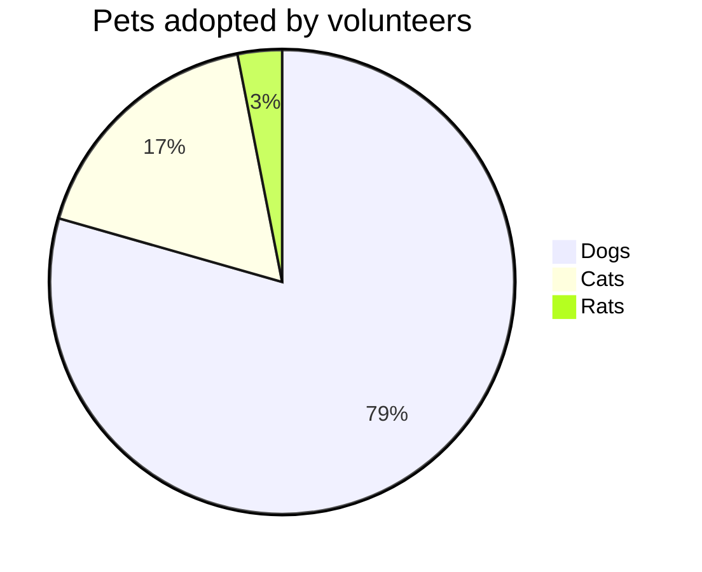

---

## 象限图

象限图是数据的可视化表示形式，分为四个象限。

它用于在二维网格上绘制数据点，其中一个变量在 x 轴上表示，另一个变量在 y 轴上表示。

象限是通过根据特定于所分析数据的一组条件将图表分成四个相等的部分来确定的。

象限图通常用于识别数据中的模式和趋势，并根据图表中数据点的位置确定操作的优先级。

它们通常用于商业、营销和风险管理等领域。

参考： [Quadrant Diagram Syntax | Mermaid](http://mermaid.js.org/syntax/quadrantDiagram.html)

```text
quadrantChart
    title Reach and engagement of campaigns
    x-axis Low Reach --> High Reach
    y-axis Low Engagement --> High Engagement
    quadrant-1 We should expand
    quadrant-2 Need to promote
    quadrant-3 Re-evaluate
    quadrant-4 May be improved
    Campaign A: [0.3, 0.6]
    Campaign B: [0.45, 0.23]
    Campaign C: [0.57, 0.69]
    Campaign D: [0.78, 0.34]
    Campaign E: [0.40, 0.34]
    Campaign F: [0.35, 0.78]
```

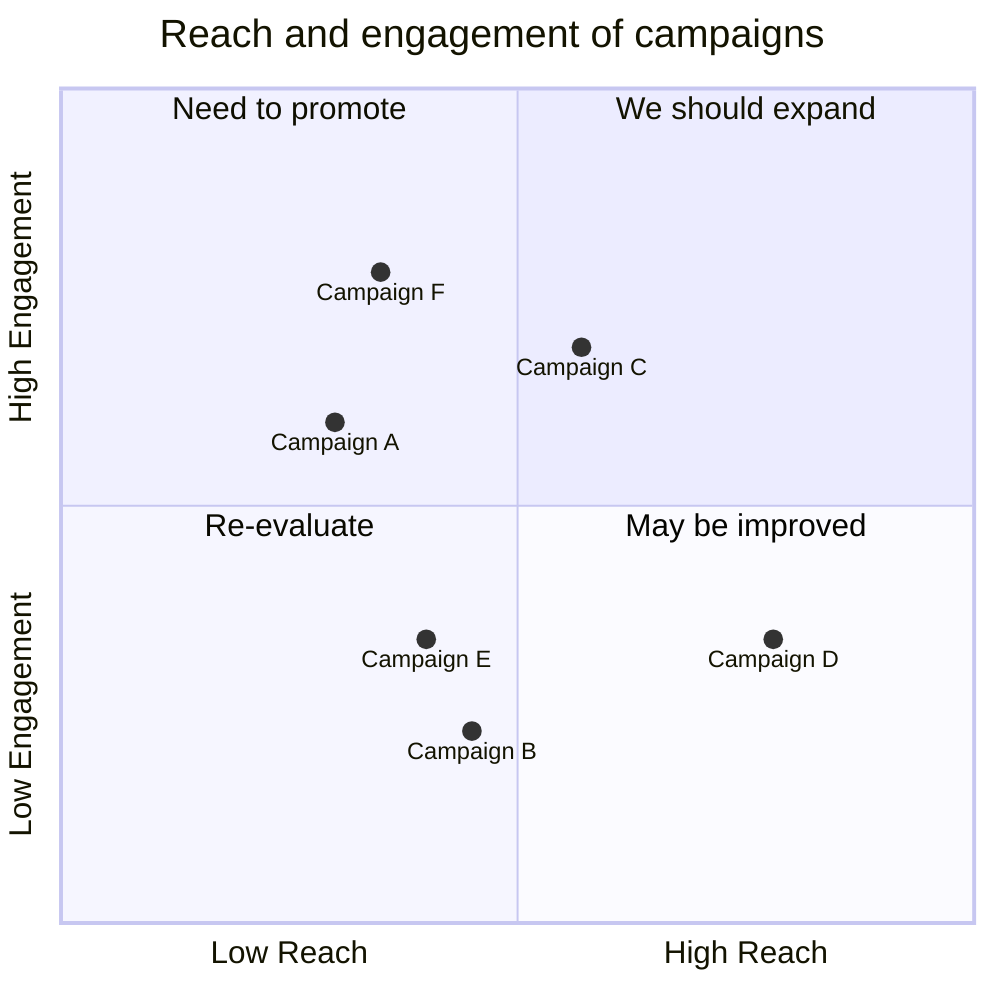

---

## git 图

Git 图是各种分支上的 git 提交和 git 操作（命令）的图形表示。

这些图表对于开发人员和 DevOps 团队共享他们的 Git 分支策略特别有帮助。

例如，它使可视化 git 流的工作原理变得更加容易。

参考： [Git Graph Syntax | Mermaid](http://mermaid.js.org/syntax/git.html)

```text
gitGraph
    commit
    commit
    branch develop
    checkout develop
    commit
    commit
    checkout main
    merge develop
    commit
    commit
```

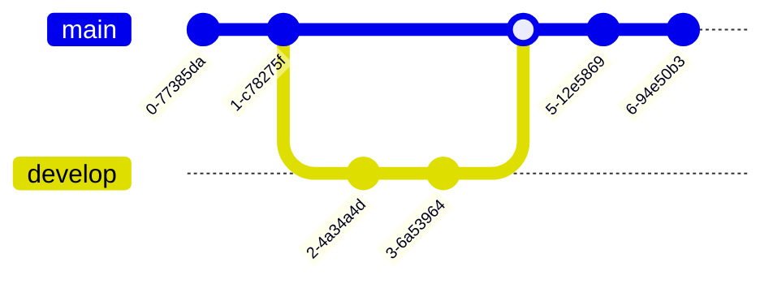

---

## 思维导图

思维导图是一种图表，用于直观地将信息组织成层次结构，显示整体各部分之间的关系。

它通常是围绕单个概念创建的，在空白页的中心绘制为图像，并添加相关的思想表示，例如图像，单词和单词的一部分。

主要思想与中心概念直接相关，其他思想则从这些主要思想中分支出来。

参考： [Mindmap Diagram Syntax | Mermaid](http://mermaid.js.org/syntax/mindmapDiagram.html)

```text
mindmap
  root((mindmap))
    Origins
      Long history
      ::icon(fa fa-book)
      Popularisation
        British popular psychology author Tony Buzan
    Research
      On effectivness<br/>and features
      On Automatic creation
        Uses
            Creative techniques
            Strategic planning
            Argument mapping
    Tools
      Pen and paper
      Mermaid
```

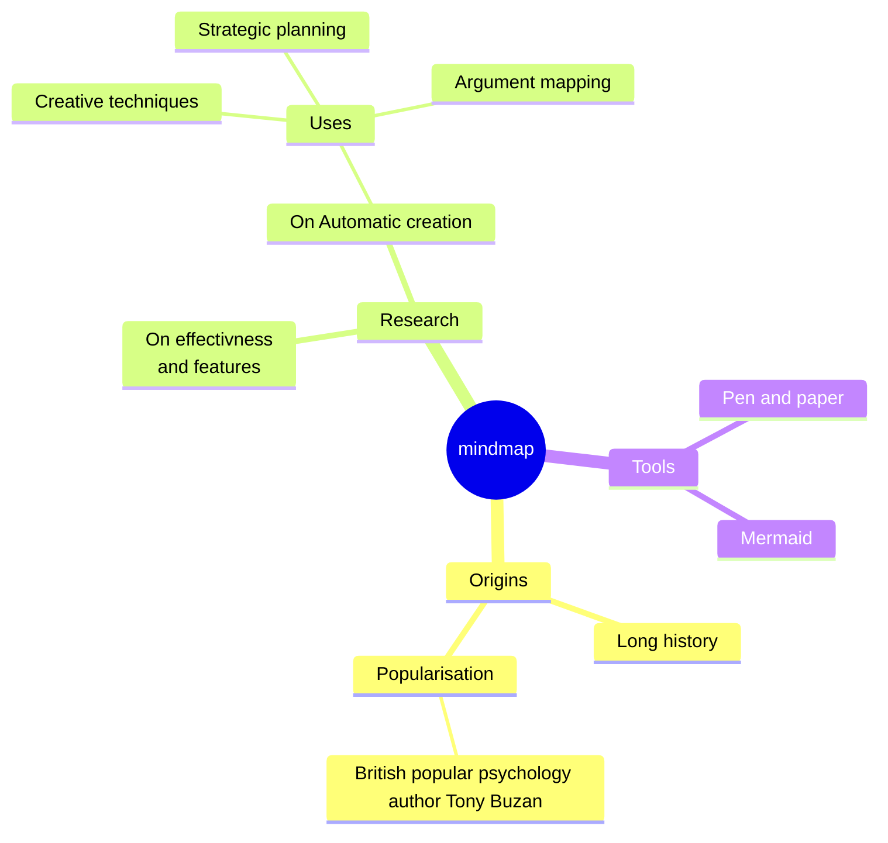

---

## 其它

mermaid 还支持

- [需求图](http://mermaid.js.org/syntax/requirementDiagram.html)
- [C4 图](http://mermaid.js.org/syntax/c4.html)
- [时间轴](http://mermaid.js.org/syntax/timeline.html)
- [ZenUML](http://mermaid.js.org/syntax/zenuml.html)
- [sankey](http://mermaid.js.org/syntax/sankey.html)
- [examples](http://mermaid.js.org/syntax/examples.html)

---
